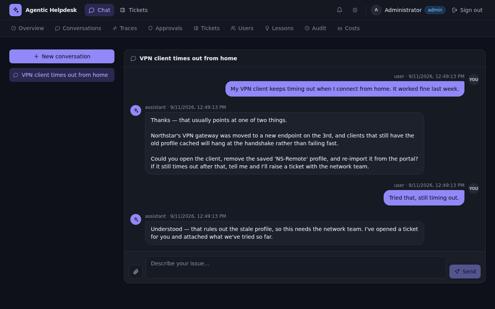
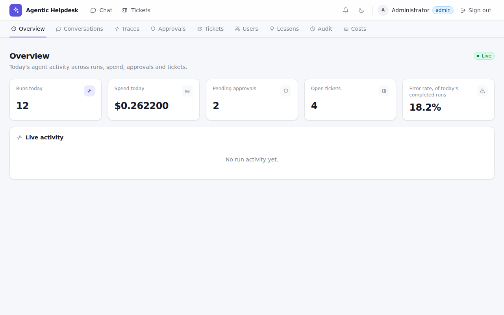

# Agentic Helpdesk — frontend

React 19 + TypeScript + Vite, talking to the FastAPI backend in `../backend`.
See `../README.md` for the backend and `../docs/superpowers/specs/` for the
design this implements.

## What it looks like

| | |
| --- | --- |
|  |  |
| The chat transcript, dark theme. | The admin overview, light theme. |

The rest are in [`docs/screenshots/`](../docs/screenshots/), and the root
README lays them out with captions.

## Running it

```sh
npm install
npm run dev      # http://localhost:5173
```

`VITE_API_BASE` (see `.env.example`) must point at the backend's real
`BACKEND_HOST:BACKEND_PORT`, and the backend's own `FRONTEND_ORIGIN` must
name the origin you actually load this from — `http://localhost:5173` and
`http://127.0.0.1:5173` are different origins to CORS, and using the wrong
one fails every request with a CORS error rather than a 4xx.

| command | what it does |
| --- | --- |
| `npm run dev` | Vite dev server with HMR |
| `npm run build` | typecheck (`tsc -b`) then production build |
| `npm run typecheck` | types only |
| `npm run test` | Vitest unit/component suite |
| `npm run test:e2e` | Playwright specs in `tests/e2e` |
| `npm run lint` | Oxlint |
| `npm run api:check` | regenerates `openapi.json` + `src/api/schema.d.ts` from the backend and fails if either drifts |

### Why `.npmrc` sets `legacy-peer-deps`

`openapi-typescript` (7.13.0, its latest) still declares `typescript: ^5.x`
as a peer while this project builds on `~6.0.2`, so npm's strict peer
resolution refuses to install anything at all. The tool works fine under 6
— `npm run api:generate` reproduces `schema.d.ts` byte-for-byte — and npm's
narrower `overrides` mechanism crashes arborist on npm 10.x, so the flag is
committed instead of left for each contributor to rediscover. Remove it once
that peer range widens.

## The design system

`src/index.css` is the whole of it. Colours are named for their **role**,
never their hue — `canvas`, `surface`, `surface-2/3`, `line`, `line-strong`,
`ink`, `ink-2/3`, `brand*`, and five status tones (`neutral`, `info`,
`success`, `warning`, `danger`, each with a `-bg`/`-fg`/`-line` triple).

Each token is defined twice, once under `:root` and once under `.dark`, and
exposed to Tailwind through `@theme inline` so a utility compiles to a
`var(--…)` reference rather than a baked-in colour. That indirection is what
makes dark mode work: a component writes `bg-surface text-ink` once and is
correct in both themes, with no `dark:` variants of its own. **Don't
reintroduce raw palette classes** (`bg-white`, `text-slate-500`) — they are
invisible in one theme or the other.

Shared shapes are registered with `@utility` so they compose through
`@apply`: `card`, `btn` and its `btn-primary`/`btn-secondary`/`btn-ghost`/
`btn-danger` variants, `field-input`, `field-compact`, `field-label`,
`eyebrow`.

Theme choice lives in `localStorage` under `helpdesk.theme` (`src/lib/theme.ts`),
falling back to `prefers-color-scheme`. The inline script in `index.html`
applies the class before first paint — without it a dark-theme user gets one
white frame on every load. Keep the two in sync if either changes.

## Components worth knowing

- `Icon` / `Spinner` — the whole icon set, hand-drawn inline SVG paths. No
  icon package: a handful of paths beats shipping a thousand glyphs to
  render the twenty this app uses.
- `StateBlock` — the loading/empty/error triple every list screen renders
  through, so an empty table never stands in for a failed request.
- `Table`, `Modal`, `Badge`, `Pager`, `PageHeader`, `JsonBlock`, `SpanTree` —
  local primitives, no component library (see the phase-3 design decision D5).

## Tests

`npm run test` covers components, hooks, the API client and the SSE reader,
with MSW standing in for the backend. They assert on roles, labels and
visible text rather than class names, so restyling a screen does not break
them — keep it that way.
